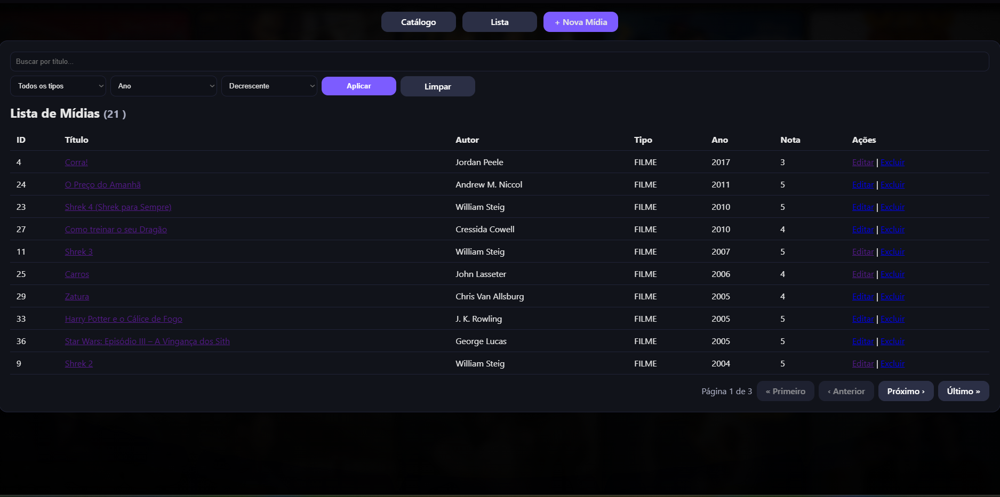
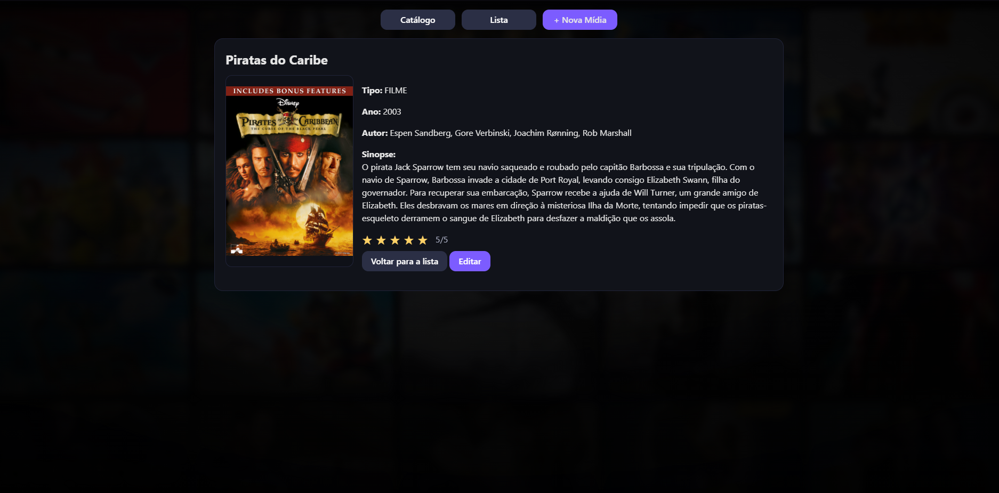
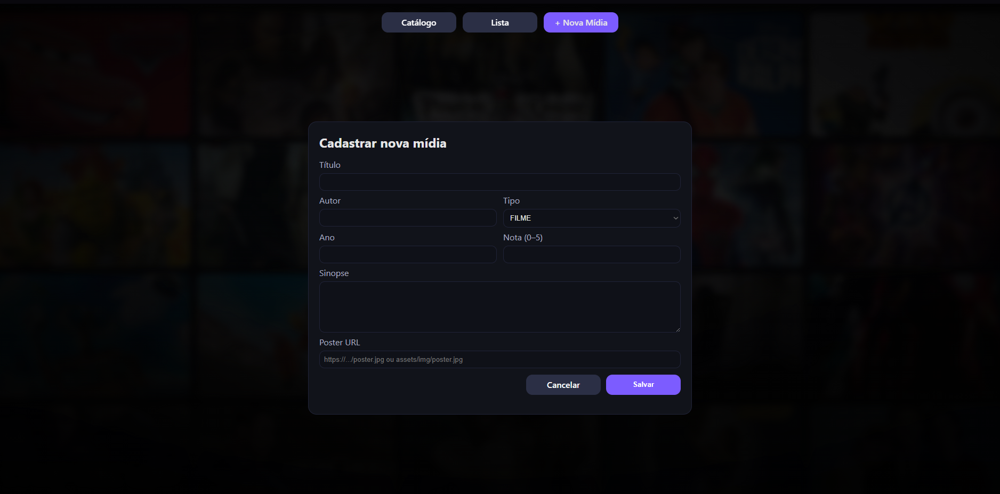

Catálogo de Mídias (Java / Servlets / JSP / JDBC)

Aplicação web para cadastro e listagem de livros e filmes, com busca, filtro por tipo, ordenação e paginação.

Stack: Java 25 · Maven · Tomcat 9 (javax) · MySQL 8 · JSP/JSTL · JDBC

✨ Funcionalidades

📍CRUD de mídias (livro/filme)

📍Busca por título 

📍Filtro por tipo (FILME / LIVRO)

📍Ordenação por id, título, autor, tipo, ano, nota

📍Paginação

📍JSP + JSTL (c, fmt) e escape com <c:out>

🚀 Como rodar localmente

1) Pré-requisitos:

📍JDK 25+

📍Maven 3.9+

📍Tomcat 9 (javax.*)

📍MySQL 8

2) Banco de dados (MySQL)

Crie o schema e a tabela:

CREATE DATABASE IF NOT EXISTS catalogo DEFAULT CHARACTER SET utf8mb4;
USE catalogo;

CREATE TABLE IF NOT EXISTS midia (
  id         INT AUTO_INCREMENT PRIMARY KEY,
  titulo     VARCHAR(200) NOT NULL,
  autor      VARCHAR(200),
  tipo       ENUM('FILME','LIVRO') NOT NULL,
  ano        INT,
  nota       DECIMAL(3,1),
  sinopse    TEXT,
  poster_url VARCHAR(300)
);

3) Credenciais da aplicação

Crie no seu computador (não vai para o Git) o arquivo src/main/resources/db.properties
com a sua senha real:

db.url=jdbc:mysql://localhost:3306/catalogo?useUnicode=true&characterEncoding=UTF-8&useSSL=false&allowPublicKeyRetrieval=true&serverTimezone=UTC
db.user=catalogo_user
db.pass='SUA_SENHA' <-- Digite aqui sua senha 

Este arquivo já está no .gitignore do projeto (não sobe para o GitHub).
Existe também src/main/resources/db.example.properties apenas como modelo.

4) (Recomendado) Usuário dedicado no MySQL:

CREATE USER IF NOT EXISTS 'catalogo_user'@'localhost' IDENTIFIED BY 'SUA_SENHA';
GRANT SELECT, INSERT, UPDATE, DELETE, CREATE, ALTER, INDEX ON catalogo.* TO 'catalogo_user'@'localhost';
FLUSH PRIVILEGES;

5) (Opcional) Dados de exemplo
INSERT INTO midia (titulo, autor, tipo, ano, nota, sinopse, poster_url) VALUES
('O Senhor dos Anéis','J.R.R. Tolkien','LIVRO',1954,9.7,'Clássico da fantasia.',NULL),
('Matrix',NULL,'FILME',1999,9.0,'Sci-fi distópico.',NULL),
('Clean Code','Robert C. Martin','LIVRO',2008,9.2,'Boas práticas de código.',NULL);

6) Build & Deploy
   
bash

mvn clean package

Faça o deploy do .war gerado em target/ no Tomcat 9 e acesse:

http://localhost:8080/<contexto>/lista.jsp

(normalmente <contexto> é o nome do artefato gerado).

🗂️ Estrutura (resumo)
src/
 ├─ main/
 │   ├─ java/br/projeto/{dao,infra,model}
 │   ├─ resources/
 │   │   ├─ db.example.properties   # exemplo (sem segredos)
 │   │   └─ db.properties           # real (LOCAL, ignorado)
 │   └─ webapp/                     # JSPs e includes
 └─ sql/
     ├─ schema.sql
     

🔐 Boas práticas aplicadas

🎯Segredos fora do repositório (db.properties ignorado)

🎯Usuário de banco dedicado com privilégios mínimos

🎯PreparedStatement em todas as consultas

🎯Whitelist de colunas no ORDER BY

🎯Escape em JSP com <c:out>

📸 Screenshots

📄 Licença

Este projeto está sob a MIT License 🎯
